# Ejercicio 1 - Etapa 1: Conexión servidor-cliente

## ✅ Objetivo

Establecer una conexión básica entre un **servidor** y un **cliente** usando sockets TCP en C#.  
El servidor espera conexiones en el puerto 5000, y el cliente se conecta a `127.0.0.1`.

---

## 📂 Estructura del proyecto

```
Ejercicio1/
├── Proyecto/
│   ├── Servidor/
│   │   ├── Program.cs
│   │   └── Servidor.csproj
│   └── Cliente/
│       ├── Program.cs
│       └── Cliente.csproj
└── README.md
```

---

## 🧪 Capturas del proceso

### 1️⃣ Servidor iniciado

El servidor se ejecuta correctamente y espera conexiones:

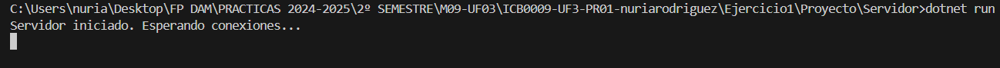

---

### 2️⃣ 2 Terminales abiertas en VS Code

Una terminal para el servidor y otra para el cliente. Se comprueba el entorno antes de lanzar el cliente:

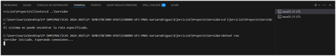

---

### 3️⃣ Cliente conectando

El cliente intenta conectarse y lo consigue:

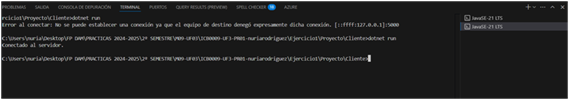

---

### 4️⃣ Resultado final

¡Cliente conectado! El servidor muestra el mensaje indicando la IP del cliente:

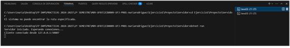

---

## 🧠 Comentarios personales

> En esta primera etapa, he comprobado cómo funciona el sistema cliente-servidor con sockets TCP en C#.  
> Aprendí a usar dos terminales de Visual Studio Code, a compilar y ejecutar proyectos con `dotnet run` y a manejar errores si el servidor no está activo.

---

## ✅ Estado de la Etapa 1

| Elemento                       | Estado     |
|--------------------------------|------------|
| Servidor funcionando           | ✅         |
| Cliente funcionando            | ✅         |
| Conexión exitosa               | ✅         |
| Documentación y capturas       | ✅         |

---


## ✅ Verificación de mejoras aplicadas

### 🔹 Cliente tras mejora de mensaje
Se ha mejorado el mensaje de error para que sea más claro si la conexión falla.

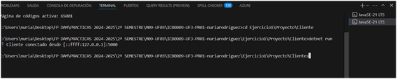

### 🔹 Servidor tras mejora visual
El mensaje en consola del servidor también se ha mejorado.

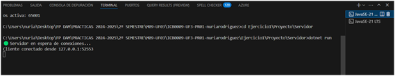

---

# 🧩 Etapa 2: Aceptación de múltiples clientes

## 🚀 Objetivo

El servidor ahora acepta múltiples clientes utilizando **hilos** para gestionar cada uno sin bloquear al principal.

## 🔄 Cambios implementados

- El servidor usa `Thread` para manejar cada cliente en segundo plano.
- Cada vez que se conecta un cliente, aparece el mensaje:  
  `🚗 Gestionando nuevo vehículo desde ...`

---

## 🖼️ Capturas de prueba de múltiples clientes

### 🔹 Servidor ejecutándose en Etapa 2

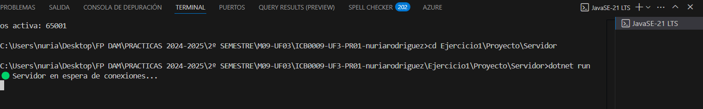

### 🔹 Varios clientes conectados correctamente

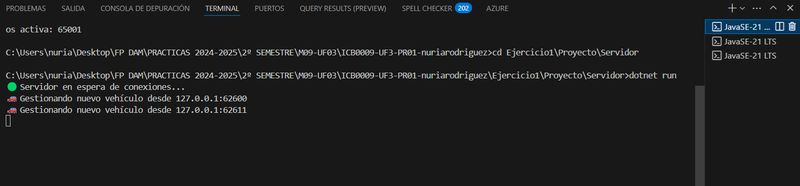

---

## ✅ Estado de la Etapa 2

| Elemento                               | Estado     |
|----------------------------------------|------------|
| Conexión múltiples clientes            | ✅         |
| Gestión concurrente con hilos          | ✅         |
| Mensaje "Gestionando nuevo vehículo..."| ✅         |
| Capturas de verificación               | ✅         |

---

# 🧩 Etapa 3: Asignación de ID único y dirección aleatoria

## 🚀 Objetivo

El servidor asigna un **ID único** y una **dirección aleatoria (NORTE/SUR)** a cada cliente que se conecta.

## 🧠 Conceptos aplicados

- Uso de una variable `siguienteId` autoincremental.
- Uso de `lock` para proteger el acceso desde múltiples hilos.
- Uso de `Random` para asignar una dirección al azar.

---

## 🖼️ Captura de prueba

### 🔹 Identificación de vehículos conectados

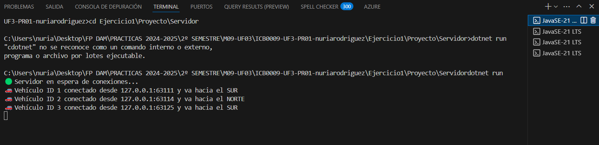

---
# 🧩 Etapa 4: Obtener NetworkStream

## 🚀 Objetivo

Obtener el `NetworkStream` tanto en el servidor como en el cliente después de establecer la conexión.

## 🔄 Cambios implementados

- En el servidor, tras aceptar un cliente, se obtiene el stream: `cliente.GetStream()`.
- En el cliente, tras conectarse, también se obtiene el stream.
- Se muestra un mensaje de confirmación en consola.

---

## 🖼️ Capturas

### 🔹 NetworkStream en el Servidor

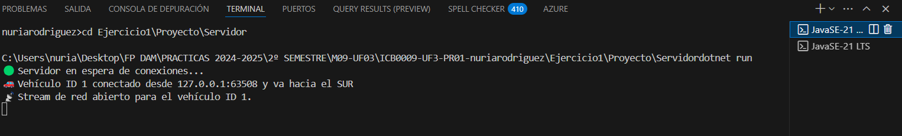

### 🔹 NetworkStream en el Cliente

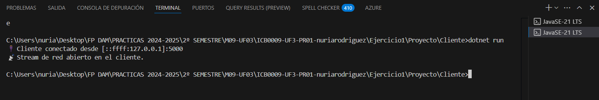

---

## ✅ Estado de la Etapa 4

| Elemento                      | Estado     |
|-------------------------------|------------|
| NetworkStream en servidor     | ✅         |
| NetworkStream en cliente      | ✅         |
| Capturas añadidas             | ✅         |

---


## 🔗 Navegación

[⬅️ Volver al README general](../README.md)
