# Ejercicio 2 - Etapa 0: Clases Vehículo y Carretera

## ✅ Objetivo

Familiarizarse con las clases base `Vehiculo` y `Carretera`, que serán esenciales para el intercambio de información entre el **cliente** y el **servidor** durante la simulación.

---

## 🚗 Clase Vehiculo

Define los datos de un vehículo en la simulación.

### Propiedades:
- `Id`: Identificador único del vehículo.
- `Pos`: Posición actual del vehículo (0 a 100).
- `Velocidad`: Velocidad aleatoria entre 100 y 500 (controla el `Thread.Sleep`).
- `Acabado`: Si el vehículo ha llegado a destino.
- `Direccion`: "Norte" o "Sur".
- `Parado`: Indica si el vehículo está esperando.

La clase también incluye métodos de **serialización** y **deserialización**.

---

## 🛣️ Clase Carretera

Representa el estado global de la simulación.

### Propiedades:
- `VehiculosEnCarretera`: Lista con todos los vehículos activos.
- `NumVehiculosEnCarrera`: Número de vehículos conectados actualmente.

### Funcionalidades:
- **AñadirVehiculo**: Agrega un nuevo vehículo a la lista.
- **ActualizarVehiculo**: Actualiza los datos de un vehículo.
- **MostrarCarretera**: Muestra visualmente el estado de la carretera.
- **Serializar / Deserializar**: Convierte la clase a bytes y viceversa.

---

## ✅ Estado de la Etapa 0

| Elemento                  | Estado |
|---------------------------|--------|
| Clase Vehiculo creada     | ✅     |
| Clase Carretera creada    | ✅     |
| Métodos de serialización  | ✅     |
| Métodos de gestión        | ✅     |
| Estructura inicial lista  | ✅     |

---

# 🧩 Etapa 1: Programación de los métodos de la clase NetworkStreamClass

## ✅ Objetivo

Implementar los métodos que permiten **enviar y recibir objetos de tipo `Vehiculo` y `Carretera`** a través de un `NetworkStream`.

---

## 🧠 Métodos implementados

### 🚗 Vehiculo
- `EscribirDatosVehiculoNS(NetworkStream NS, Vehiculo V)`
- `LeerDatosVehiculoNS(NetworkStream NS)`

### 🛣️ Carretera
- `EscribirDatosCarreteraNS(NetworkStream NS, Carretera C)`
- `LeerDatosCarreteraNS(NetworkStream NS)`

---

## 🔄 Funcionamiento

- Los métodos de escritura (`Escribir...`) **serializan** el objeto y lo envían como bytes.
- Los métodos de lectura (`Leer...`) **reciben bytes** y los **deserializan** para reconstruir el objeto.

---

## ✅ Estado de la Etapa 1

| Elemento                              | Estado |
|---------------------------------------|--------|
| Métodos de Vehiculo implementados     | ✅     |
| Métodos de Carretera implementados    | ✅     |
| Uso de Serialización/Deserialización  | ✅     |

# 🛠️ Etapa 2: Crear y enviar los datos de un Vehiculo

## ✅ Objetivo

El cliente debe ser capaz de crear un objeto `Vehiculo`, enviarlo al servidor y recibir como respuesta la `Carretera` actualizada. El servidor debe recibir el vehículo, añadirlo a la carretera y devolver el estado actualizado.

---

## ⚙️ Cambios realizados

### Cliente (`Program.cs`)

- Se crea un objeto `Vehiculo` con datos como ID aleatorio y dirección (`"Norte"`).
- Se envía el vehículo usando `EscribirDatosVehiculoNS()`.
- Se recibe la carretera actualizada y se muestra por consola.

### Servidor (`Program.cs`)

- Escucha conexiones entrantes.
- Lee el objeto `Vehiculo` desde el cliente.
- Añade el vehículo a la `Carretera`.
- Muestra el estado actual de la carretera por consola.
- Devuelve la carretera al cliente.

---

## 📸 Capturas de pantalla

A continuación se muestran las evidencias visuales del funcionamiento del sistema cliente-servidor:

1. Cliente conectado al servidor
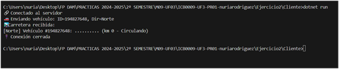

2. Servidor esperando cliente
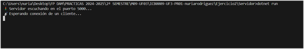

3. El servidor recibe un vehículo
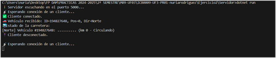

4. Carretera mostrada por el servidor
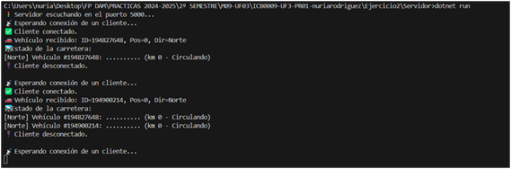

5. Carretera recibida por el cliente
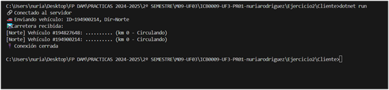

6. Cliente conectándose varias veces (1)
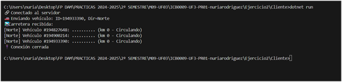

7. Cliente conectándose varias veces (2)

8. Servidor con múltiples vehículos
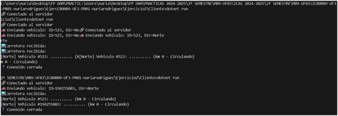

---

## ✅ Estado de la Etapa 2

| Elemento                        | Estado |
|---------------------------------|--------|
| Cliente crea vehículo           | ✅     |
| Envío de datos al servidor      | ✅     |
| Servidor añade vehículo         | ✅     |
| Mostrar estado carretera        | ✅     |
| Respuesta del servidor al cliente | ✅   |
| Capturas generadas              | ✅     |

# 🚦 Etapa 3: Mover los vehículos

## ✅ Objetivo

Simular el movimiento del vehículo por la carretera desde el cliente, enviando su estado actualizado al servidor hasta que termine su recorrido.

---

## ⚙️ Cambios realizados

### 👨‍💻 Cliente

- Se añade un bucle `while (v.Pos <= 100)` para simular el avance del vehículo.
- Se actualiza `v.Pos++` y se hace `Thread.Sleep(v.Velocidad)` para controlar el ritmo.
- Se actualiza `v.Acabado = true` al finalizar.
- Se envía el objeto actualizado al servidor en cada iteración.

### 🖥️ Servidor

- Se crea un bucle que lee constantemente los datos del cliente.
- Se actualiza el estado de la carretera usando `ActualizarVehiculo()`.
- Se muestra el estado actualizado de la carretera por consola.
- Se cierra la conexión cuando `v.Acabado == true`.

---

## ✅ Estado de la Etapa 3

| Elemento                                | Estado |
|-----------------------------------------|--------|
| Bucle de movimiento en cliente          | ✅     |
| Envío de datos a cada iteración         | ✅     |
| Recepción continua en el servidor       | ✅     |
| Actualización de carretera en servidor  | ✅     |
| Visualización de estado de la carrera   | ✅     |

---

## 📸 Capturas de pantalla

A continuación se muestran las evidencias visuales del funcionamiento de esta etapa:

1. Cliente crea y mueve vehículo
   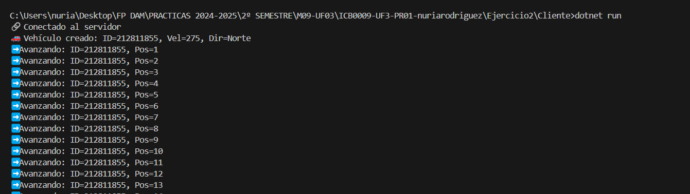

2. Servidor muestra actualizaciones recibidas
   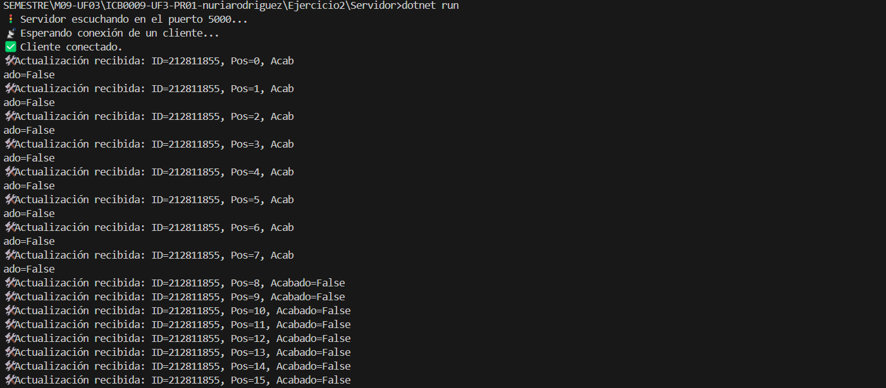

3. Cliente muestra final del recorrido
   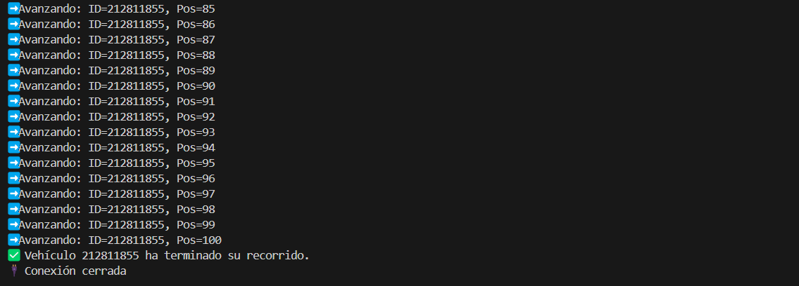

4. Servidor detecta vehículo finalizado
   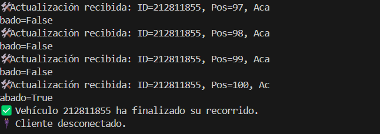

---

# 🔁 Etapas 4 y 5: Enviar y recibir la información de la carretera

## ✅ Objetivo

El objetivo de estas etapas es que **todos los clientes** puedan ver la **carretera completa** con todos los vehículos en movimiento, no solo el suyo propio.

- En la **Etapa 4**, el servidor debe **enviar la carretera actualizada** a todos los clientes cada vez que reciba una actualización.
- En la **Etapa 5**, los clientes deben tener **un hilo de escucha permanente** que reciba esos datos del servidor y los muestre por consola.

---

## ⚙️ Cambios realizados

### 🖥️ Servidor

- Se mantiene una **lista de clientes conectados**.
- Se envía la carretera actualizada a **todos los clientes** cada vez que se recibe un nuevo dato.
- Se utiliza un método llamado `EnviarCarreteraATodos()`.

### 👨‍💻 Cliente

- Se crea un **hilo adicional** que permanece escuchando al servidor.
- Este hilo recibe el objeto `Carretera` y muestra la información por consola.
- Ambos hilos (mover vehículo y escuchar al servidor) funcionan **concurrentemente**.

---

## ✅ Estado de las Etapas 4 y 5

| Elemento                                        | Estado |
|-------------------------------------------------|--------|
| Lista de clientes en servidor                   | ✅     |
| Envío de carretera a todos los clientes         | ✅     |
| Hilo de escucha en el cliente                   | ✅     |
| Visualización concurrente en el cliente         | ✅     |
| Pruebas con múltiples vehículos y clientes      | ✅     |
| Capturas generadas                              | ✅     |

---

## 📸 Capturas de pantalla

A continuación se muestran las evidencias visuales del funcionamiento de estas etapas:

1. Servidor esperando vehículos y mostrándolos
   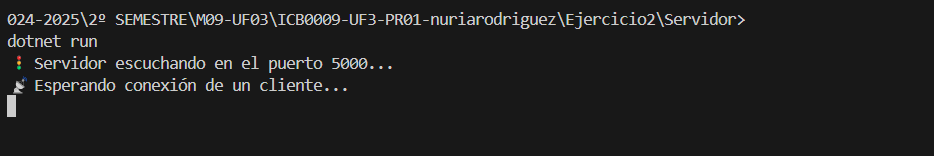

2. Cliente recibiendo actualizaciones de la carretera
   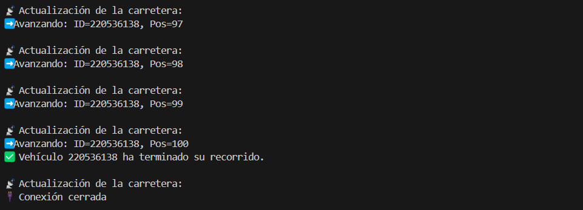

3. Cliente muestra final del recorrido
   

4. Servidor detecta que el vehículo ha finalizado su recorrido
   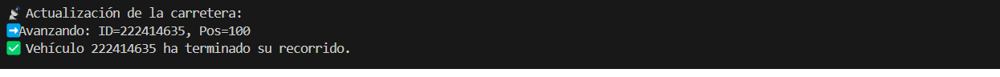

---

## 🔗 Navegación

[⬅️ Volver al README general](../README.md)