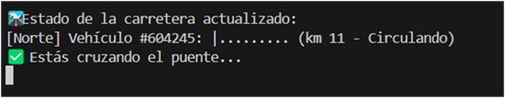
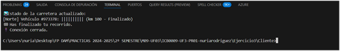
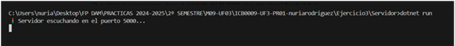
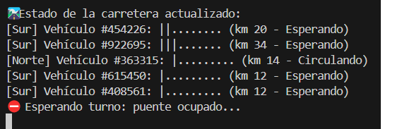

# 🛣️ Ejercicio 3 - Control de Tráfico en el Puente

## 🔗 Objetivo General
Este ejercicio simula una carretera con un **puente que solo permite el paso de un vehículo a la vez**. El objetivo es sincronizar correctamente el cruce de los vehículos para:

1. Garantizar que **solo un vehículo** cruce el puente en cada momento.
2. Hacer que los **vehículos en dirección opuesta esperen** si el puente ya está ocupado.

---

## 🌉 Funcionamiento: Paso único por el túnel

Para completar la carrera se ha implementado la lógica que permite:

- 🚗 Solo un vehículo en el puente a la vez.
- ⛔ Vehículos en dirección contraria esperan hasta que el puente esté libre.

📌 **Decisión técnica**: El control del puente se ha implementado en el **servidor** para mantener un control centralizado del recurso compartido.

---

## 🔄 Ejemplo de flujo esperado

```
Vehículo #1 (Norte) entra al puente   ➔ Servidor: VehiculoEnPuente = #1
Vehículo #2 (Norte) intenta entrar   ➔ Servidor: "Esperando: Puente ocupado por #1"
Vehículo #1 sale del puente         ➔ Servidor: VehiculoEnPuente = null
Vehículo #2 recibe notificación y entra
```

---

## 🔧 Requisitos técnicos

- ✅ El **servidor** debe mantener el control del vehículo que está en el puente.
- ✅ Los **clientes** deben mostrar su estado actual:
  - "⛔ Esperando: puente ocupado..."
  - "✅ Estás cruzando el puente..."
  - "🏎️ Vehículo ha finalizado el recorrido."

---

## 🧠 Pregunta teórica 1
### ❓ ¿Es mejor programar el control del puente en el cliente o en el servidor?

**Respuesta:**

- **Servidor (opción elegida)**:
  - ✅ Ventajas:
    - Control centralizado.
    - Evita condiciones de carrera.
    - Escalable y mantenible.
  - ❌ Inconvenientes:
    - Más carga computacional.

- **Cliente:**
  - ✅ Menor carga al servidor.
  - ❌ Posibilidad de errores de sincronización y condiciones de carrera.

✅ **Conclusión**: Es mejor implementar el control desde el servidor.

---

## 💡 Pregunta teórica 2
### ❓ ¿Cómo gestionar colas de espera en el servidor? ¿Qué estructura usar?

**Respuesta:**

- Usar **una cola por dirección**:

```csharp
Queue<Vehiculo> colaNorte = new();
Queue<Vehiculo> colaSur = new();
```

- ✅ Ventajas:
  - Gestiona el orden de llegada.
  - Evita monopolio de una sola dirección.
  - Permite alternancia entre sentidos.

Opcionalmente se podría usar una `PriorityQueue` para considerar otros factores (espera, prioridad, etc.).

Actualmente, la variable `VehiculoEnPuente` actúa como **semáforo simple**.

---

## 📂 Archivos modificados clave

- `Servidor/Program.cs`: lógica principal de control del puente.
- `Modelo/Carretera.cs`: nueva propiedad `VehiculoEnPuente`.
- `Cliente/Program.cs`: detección de espera, cruce y finalización.

---

## 📸 Capturas de pantalla

| Descripción                         | Imagen                                                                 |
|-------------------------------------|------------------------------------------------------------------------|
| 🚗 Cliente cruzando el puente        |                            |
| 🏁 Cliente finaliza correctamente    |              |
| 🖥️ Servidor escuchando               |                         |

---

## ✅ Estado final del ejercicio

| Elemento                                           | Estado |
|---------------------------------------------------|--------|
| Lógica de cruce exclusivo del puente              | ✅     |
| Registro del vehículo en el puente                | ✅     |
| Clientes muestran estado (esperando/pasando)      | ✅     |
| Cliente detecta fin de recorrido                  | ✅     |
| Servidor actualiza y notifica a todos los clientes| ✅     |
| Capturas generadas                                | ✅     |

---

## 🎁 BONUS Extra - Turnos alternos entre direcciones

Se ha añadido una mejora opcional que **alterna los turnos de cruce** entre vehículos del Norte y del Sur para garantizar equidad.

### ✅ Captura de prueba de los turnos alternos:

| Descripción                               | Imagen                                                    |
|-------------------------------------------|-----------------------------------------------------------|
| 🚦 Turnos alternos detectados por el servidor |                 |

Esta lógica garantiza que no se bloquee indefinidamente una de las direcciones.

---

## 🗃️ Comparativa Cliente vs Servidor

| Característica        | Cliente                              | Servidor                                 |
|-----------------------|---------------------------------------|------------------------------------------|
| Control del puente    | ❌ No recomendado                     | ✅ Control centralizado                   |
| Carga computacional   | ✅ Menor                              | ❌ Mayor                                  |
| Riesgo de errores     | ❌ Alto (condiciones de carrera)      | ✅ Bajo                                   |
| Escalabilidad         | ❌ Complicado                         | ✅ Sencilla                               |

---
## 📁 Navegación
[⬅️ Volver al README principal](../README.md)


